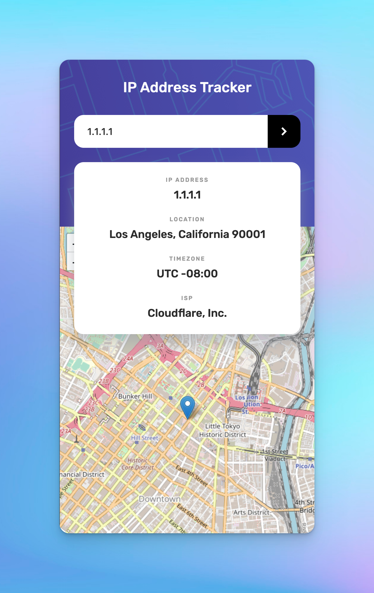

# IP address lookup application

This is my solution to the [IP address tracker challenge on Frontend Mentor](https://www.frontendmentor.io/challenges/ip-address-tracker-I8-0yYAH0).

### Live Site URL: [ip-lookup-saish.vercel.app](https://ip-lookup-saish.vercel.app)

## Table of contents

- [Overview](#overview)
  - [The challenge](#the-challenge)
  - [Screenshot](#screenshot)
  - [Links](#links)
- [My process](#my-process)
  - [Built with](#built-with)

## Overview

### The challenge

Users should be able to:

- View the optimal layout for each page depending on their device's screen size
- See hover states for all interactive elements on the page
- See their own IP address on the map on the initial page load
- Search for any IP addresses or domains and see the key information and location

My additions:

- If the user enters wrong IP, domain or email, the page goes back to their own IP address and it's info.
- An error state where if the incorrect IP address, domain or email is entered (in the query string), it will show an error on the page.

### Screenshot

  

### Links

- Solution URL: [GitHub](https://github.com/SaishSankhe/ip-lookup-app)
- Live Site URL: [Vercel](ip-lookup-saish.vercel.app)

## My process

### Built with

- [Next.js](https://nextjs.org/) - React framework
- Semantic HTML5 markup
- [SCSS](https://sass-lang.com/) - CSS
- Flexbox
- [IP Geolocation API by IPify](https://geo.ipify.org/)
- [Leaflet API](https://leafletjs.com/)

### What I learned

Doing this project, I learnt how to use URL query strings in NextJS. It was also interesting to understand and work with IP Geolocation and Leaflet API to get the desired results.
